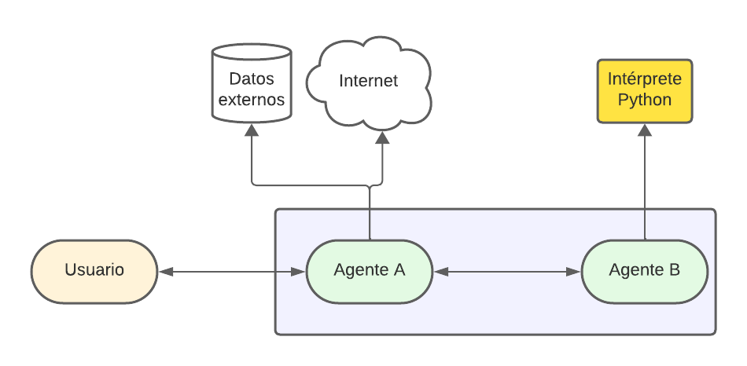

# Ejercicio 1

## Fuente de datos

Para la implementación del **RAG** se utilizaron como fuentes de datos los siguientes recursos:

- Archivos `pdf` de la documentación oficial de Python.
- Archivo `csv` sobre repositorios populares de Python.
- Base de datos de grafos online DBpedia.

A los archivos `pdf` se les extrajo el texto y se normalizo para luego vectorizarlos y almacenarlos en una base de datos ChromaDB. Respecto a los datos tabulares del `csv` se decidió quedarse solamente con las entradas del año 2023 debido a que el archivo es muy extenso. Por último se usará la base de datos externa para aquellas búsquedas relacionadas con programación pero no específicamente sobre Python.

## Elección de la fuente de datos.

Se utilizará el modelo pre-entrenado `paraphrase-MiniLM-L6-v2` para hacer el embedding de la consulta del usuario y calcular la similaridad con las consultas de ejemplo, de esta forma se puede elegir cual de las tres fuentes externas es más probable que responda la pregunta original.

## RAG

La 'generación aumentada por recuperación' (RAG) consiste en proporcionar a los modelos de lenguaje de gran escala (LMM) información de contexto adicional sobre algún tema en particular. Esto permite que los modelos puedan producir respuestas más exactas.

Finalmente se puede apreciar que el sistema responde de forma satisfactoria a las consultas usando solamente la información que obtiene del prompt de contexto que se le brinda.

# Ejercicio 2

Los sistemas de agentes inteligentes son estructuras diseñadas para interactuar con su entorno, procesar información y tomar decisiones en función de los datos disponibles. Entre estos, los modelos de lenguaje de gran escala (LLM) destacan como exponentes de la inteligencia artificial capaces de manejar y generar lenguaje natural en gran volumen. Estos modelos son entrenados con extensas cantidades de datos textuales, lo que les permite comprender y producir contenido lingüístico de manera efectiva y precisa.

Por ende, un agente que se fundamenta en modelos de lenguaje de gran escala (LLM) muestra un potencial significativo para abordar una amplia gama de problemas prácticos cuando se le coloca en un entorno pertinente. En la actualidad, se encuentran disponibles diversos modelos, tanto de carácter privado como de código abierto, lo que amplía las opciones para su aplicación en distintos ámbitos y contextos.

Algunos ejemplos de agentes inteligentes de propiedad privada incluyen ChatGPT y Bard. Estos modelos son altamente valorados y ampliamente adoptados a nivel mundial. Poseen la capacidad de abordar tanto situaciones simples como complejas planteadas por los usuarios en diversos contextos, utilizando exclusivamente lenguaje natural humano, ya sea hablado o escrito.

Últimamente, los modelos de agentes inteligentes han evolucionado mediante la integración con otros sistemas, permitiendo la orquestación de múltiples agentes para resolver problemas complejos. Estas integraciones incluyen capacidades como la carga y análisis de archivos, que posibilitan a los usuarios subir documentos o imágenes y obtener resúmenes, categorías o etiquetas relevantes. Además, se han incorporado herramientas externas como navegación web, análisis de datos y sistemas de generación y reconocimiento de imágenes. Sin embargo, estos sistemas multiagente actualmente están disponibles únicamente  para usuarios de pago, careciendo de acceso libre o código abierto para el público en general.

A pesar de esto, hay proyectos de código abierto en desarrollo que buscan crear sistemas multiagentes similares. Un ejemplo es AutoGPT, un proyecto en Github que combina el modelo de lenguaje similar a ChatGPT con técnicas de auto-prompting para mejorar la autonomía del modelo en la resolución de problemas genéricos.

Algunos de los casos de uso para este tipo de sistemas son los siguientes:

## Salud
Los LLMs multiagentes pueden proporcionar expertise bajo demanda en áreas como diagnósticos y opciones de tratamiento, mejorando la atención al paciente y los resultados médicos

## Finanzas
Las instituciones financieras pueden emplear LLMs multiagentes para analizar tendencias del mercado, evaluar estrategias de inversión y ofrecer asesoramiento financiero personalizado, mejorando sus servicios y la satisfacción del cliente.

## Educación
Estos sistemas pueden revolucionar la educación al brindar a los estudiantes acceso a expertos en diversas materias, ofreciendo experiencias de aprendizaje personalizadas y fomentando el crecimiento académico.
 
# Planteo de problemática

La problemática planteada es la de permitir que personas que estén dando sus primeros pasos en programación puedan usar un sistema multiagente para obtener respuestas a sus dudas, sugerencias y *feedback* para mejorar el código que escriben.

Para lograr esto considero que sería necesario contar con dos agente, uno de ellos sería el encargado de generar el código Python para responder las consultas del usuario, deberá tener acceso a un intérprete del lenguaje para poder ejecutar el código del usuario y los mismo mensajes de error del propio intérprete para ayudar a resolver el problema.

El segundo agente será intermediario entre el usuario y el agente especializado en analizar y generar código, este segundo agente prepara el prompt con contexto adicional en caso de ser necesario, deberá tener acceso a internet para buscar información sobre Python o alguna de sus librerías.

# Fuentes
- [Intelligent agent - Wikipedia](https://en.wikipedia.org/wiki/Intelligent_agent)
- [Application of Pretrained Large Language Models in Embodied Artificial Intelligence](https://link.springer.com/article/10.1134/S1064562422060138)
- [Revolutionizing AI: The Era of Multi-Agent Large Language Models](https://gafowler.medium.com/revolutionizing-ai-the-era-of-multi-agent-large-language-models-f70d497f3472)
